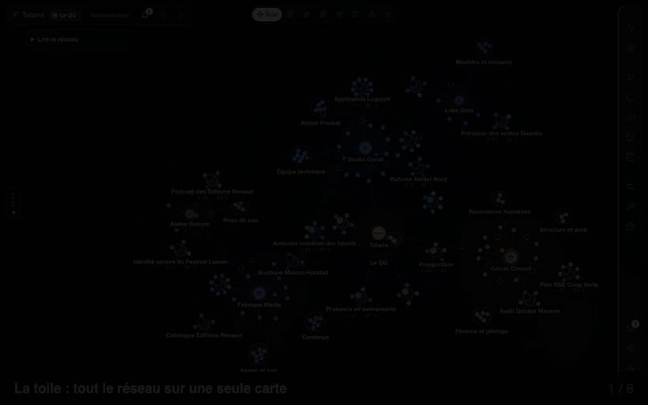
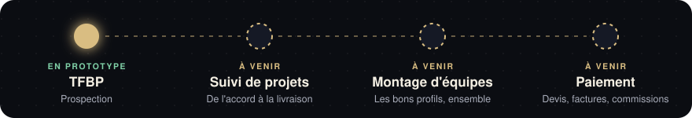

  

<strong>Le réseau privé où les meilleurs indépendants et les entreprises qui les cherchent se retrouvent sur une seule carte.</strong>

Sur cooptation · Prototype en développement · <a href="https://github.com/TalariaIsComming/Talaria-Public">La vitrine de Talaria</a> · <a href="https://github.com/TalariaIsComming/TFBP-Public">TFBP, l'outil de prospection</a>

> **Ce profil est une vitrine.** Vous y trouvez des captures et des animations de l'interface de Talaria, un visualiseur front encore à l'état de prototype. Aucun code n'est publié : le produit vit dans un dépôt privé. Les personnes, entreprises et logos visibles à l'écran sont inventés pour la démonstration.

## Talaria en trente secondes

  

Talaria réunit des réseaux d'indépendants et d'entreprises sur une toile vivante. On y entre parce qu'un membre se porte garant, on y voit qui travaille avec qui, et on y forme les équipes qu'on n'aurait jamais montées seul.

## Pour qui

| Vous êtes | Ce que Talaria vous apporte |
|---|---|
| **Indépendant** | Un réseau choisi, des projets qui affichent les compétences qu'il leur manque, une place à prendre en un clic. |
| **Entreprise** | Des profils recommandés par quelqu'un qui engage son nom, et la carte de qui sait faire quoi. |
| **Responsable de réseau** | Votre communauté avec son identité propre, ses invitations, ses sous-réseaux et son activité, au même endroit. |

## Comment on y entre

  

Il n'y a pas d'inscription ouverte. Chaque profil garde la trace de qui l'a invité et de qui l'a validé : la confiance se lit sur la carte.

## Ce que l'on y fait

<table>
<tr>
<td width="50%" valign="top">
 
<strong>Voir son réseau.</strong> Tout tient sur une toile : le QG au centre, les réseaux, leurs groupes et leurs projets autour.
</td>
<td width="50%" valign="top">
 
<strong>Reconnaître les siens.</strong> Chaque réseau tire son identité de son secteur : deux couleurs, un motif, un emblème.
</td>
</tr>
<tr>
<td valign="top">
 
<strong>Monter un projet.</strong> Son contour se remplit à mesure que ses compétences sont couvertes. Une place libre ? On la prend.
</td>
<td valign="top">
 
<strong>Répondre à une question.</strong> Huit façons de lire le même réseau : qui sait faire quoi, quand, avec qui, qui est libre.
</td>
</tr>
<tr>
<td valign="top">
 
<strong>Proposer ses services.</strong> Le Shop accueille les annonces entre membres et les offres officielles.
</td>
<td valign="top">
 
<strong>Se présenter à sa façon.</strong> Un blaze peut remplacer le nom ; l'identité réelle reste connue des garants.
</td>
</tr>
</table>

## Les fonctionnalités

| Déjà dans le prototype | En préparation |
|---|---|
| Cooptation, rôles et niveaux d'engagement | Envoi des invitations par e-mail |
| Toile du réseau et huit modes de vue | Talabot branché à un modèle d'IA |
| Réseaux, sous-réseaux, groupes, projets | Paiement et commissions |
| Messagerie, calendrier, questionnaires, badges | Application téléphone complète |
| Shop, profils, blazes | Mise en production |
| Talabot, l'assistant qui mène la visite guidée | TFBP, l'outil de prospection (en prototype) |

## Les outils de Talaria

Le réseau ne suffit pas : il faut aussi de quoi travailler. Talaria s'accompagne d'outils pensés pour ses membres, qui partagent son interface et son assistant, Talabot.

  

### TFBP · Tools For Best Prospection

**Le copilote qui décroche avec toi.** Des leads prêts à appeler, une fiche qui tient sur un écran, et Talabot qui montre quoi dire pendant l'appel.

  

| | |
|---|---|
| **Trouve** | Les leads se créent, s'enrichissent et se trient en vert, orange, rouge. |
| **Appelle** | L'entreprise, son site, ses réseaux et ton interlocuteur sur un seul écran. |
| **Rebondis** | L'aide s'affiche quand une objection arrive ; Talabot pointe la bonne information. |
| **Conclus** | Rendez-vous en deux clics, mail de suivi qui s'écrit tout seul. |
| **Progresse** | Chaque séance se termine par un retour : à corriger, bons points, rendez-vous. |

<a href="https://github.com/TalariaIsComming/TFBP-Public"><strong>Voir la présentation de TFBP, avec le film et la démo →</strong></a>

### À venir

| Outil | Ce qu'il fera |
|---|---|
| **Suivi de projets** | Suivre une mission de l'accord à la livraison, côté client comme côté indépendant. |
| **Montage d'équipes** | Réunir les bons profils du réseau autour d'un besoin, en quelques clics. |
| **Paiement** | Devis, factures et commissions entre membres. |

Ces outils sont à l'étude : leur contenu et leur ordre peuvent changer.

## L'équipe

  

## Ce que je sais faire

| | |
|---|---|
| **Front-end** | React, Next.js, TypeScript, Astro. Des interfaces rapides, adaptatives et accessibles. |
| **Design UI/UX** | Identité visuelle, système de design, parcours utilisateur, maquettes interactives. |

Je conçois l'interface et je la code : la même personne tient la cohérence, du premier croquis au dernier pixel.

## Rejoindre Talaria

Talaria est un réseau privé : l'entrée se fait sur invitation d'un membre. Le prototype n'est pas encore ouvert.

---

© Talaria. Tous droits réservés. Les textes et les images de ce profil ne sont pas libres de droits.

